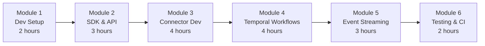

# Training Manual for Developers -- ERP-iPaaS
> Version: 1.0 | Last Updated: 2026-02-23 | Status: Draft
> Classification: Internal | Author: AIDD System

## 1. Training Overview

This training manual provides a structured curriculum for developers building custom integrations, connectors, Temporal workflows, and ETL pipelines on the ERP-iPaaS platform.

## 2. Curriculum Structure



**Total Duration**: 18 hours (3 days)

## 3. Module 1: Development Environment (2 hours)

### 3.1 Learning Objectives
- Set up local development environment
- Run the full stack via Docker Compose
- Navigate the codebase

### 3.2 Lab: Local Stack Setup

```bash
# Install prerequisites
nvm install 18 && nvm use 18
brew install go helm kubectl kind

# Start Docker Compose
docker compose up -d

# Verify all services
curl localhost:8080/healthz    # Activepieces
curl localhost:7233            # Temporal
curl localhost:8123/ping       # ClickHouse
curl localhost:3000            # Grafana

# Bootstrap Kubernetes
make bootstrap
```

### 3.3 Codebase Walkthrough

| Directory | Purpose | Key Files |
|-----------|---------|-----------|
| `services/` | Go microservices | `main.go` per service |
| `packages/` | TypeScript/Go packages | SDK, CLI, engine |
| `temporal/` | Temporal workflows | `src/workflows/*.ts` |
| `activepieces/` | Custom pieces | `pieces/*/src/index.ts` |
| `config/` | Configuration | DDL, schemas, alerts |
| `infra/` | Infrastructure | Helm, Terraform, ArgoCD |

## 4. Module 2: SDK and API Usage (3 hours)

### 4.1 Learning Objectives
- Use the TypeScript SDK to interact with the Integration Layer
- Use the Go SDK for server-side integrations
- Authenticate via OAuth2 and API keys

### 4.2 Lab: TypeScript SDK

```typescript
import { IntegrationClient } from '@billyronks/integration-layer-ts';

const client = new IntegrationClient({
  baseUrl: 'http://localhost:8080',
  tenantId: 'dev-tenant',
  accessToken: 'dev-token',
});

// Create a connector
const connector = await client.connectors.create({
  name: 'lab-connector',
  semanticVersion: '0.1.0',
  categories: ['Lab'],
});
console.log('Created:', connector.id);

// Publish an event
await client.events.publish({
  topic: 'lab.events',
  payload: { action: 'test' },
});
```

### 4.3 Lab: REST API Direct Usage

```bash
# Create a workflow
curl -X POST http://localhost:8080/v1/workflow-engine \
  -H "X-Tenant-ID: dev-tenant" \
  -H "Content-Type: application/json" \
  -d '{"name":"lab-workflow","type":"temporal"}'

# List workflows
curl -H "X-Tenant-ID: dev-tenant" http://localhost:8080/v1/workflow-engine
```

## 5. Module 3: Custom Connector Development (4 hours)

### 5.1 Learning Objectives
- Scaffold a new connector using the CLI
- Implement authentication (OAuth2, API Key)
- Define actions and triggers
- Validate and publish to the marketplace

### 5.2 Lab: Build a Weather Connector

**Step 1**: Scaffold
```bash
npx @billyronks/connector-cli scaffold weather-connector
cd weather-connector
```

**Step 2**: Implement authentication
```typescript
// src/auth.ts
export const weatherAuth = {
  type: 'API_KEY' as const,
  headerName: 'X-API-Key',
};
```

**Step 3**: Implement action
```typescript
// src/actions/get-weather.ts
export const getWeatherAction = {
  name: 'get-weather',
  displayName: 'Get Weather',
  description: 'Fetch current weather for a city',
  inputSchema: {
    type: 'object',
    properties: {
      city: { type: 'string', description: 'City name' },
    },
    required: ['city'],
  },
  execute: async (context: any, input: any) => {
    const response = await fetch(
      `https://api.weather.com/v1/current?city=${input.city}`,
      { headers: { 'X-API-Key': context.auth.apiKey } }
    );
    return response.json();
  },
};
```

**Step 4**: Validate and publish
```bash
npx @billyronks/connector-cli validate --strict
npx @billyronks/connector-cli publish --version 1.0.0
```

## 6. Module 4: Temporal Workflow Development (4 hours)

### 6.1 Learning Objectives
- Write Temporal workflows in TypeScript
- Implement activities with retry policies
- Handle long-running workflows with signals
- Test workflows with the Temporal test environment

### 6.2 Lab: Invoice Processing Workflow

```typescript
// workflows/invoice-processing.ts
import { proxyActivities, defineSignal, setHandler, condition } from '@temporalio/workflow';

const { extractInvoiceData, validateInvoice, postToERP, notifyFinance } =
  proxyActivities({
    startToCloseTimeout: '10 minutes',
    retry: { maximumAttempts: 3, backoffCoefficient: 2 },
  });

const approvalSignal = defineSignal<[boolean]>('approval');

export async function invoiceProcessingWorkflow(input: {
  tenantId: string;
  documentUrl: string;
}) {
  // Step 1: Extract data from invoice document
  const invoiceData = await extractInvoiceData({
    url: input.documentUrl,
  });

  // Step 2: Validate invoice
  const validation = await validateInvoice({
    tenantId: input.tenantId,
    data: invoiceData,
  });

  // Step 3: If amount > threshold, wait for human approval
  let approved = true;
  if (invoiceData.amount > 10000) {
    await notifyFinance({
      message: `Invoice ${invoiceData.id} requires approval: $${invoiceData.amount}`,
    });

    // Wait for approval signal (timeout after 48 hours)
    setHandler(approvalSignal, (isApproved) => {
      approved = isApproved;
    });
    await condition(() => approved !== undefined, '48 hours');
  }

  if (approved) {
    // Step 4: Post to ERP Finance module
    await postToERP({
      tenantId: input.tenantId,
      invoice: invoiceData,
    });
  }

  return { processed: approved, invoiceId: invoiceData.id };
}
```

### 6.3 Lab: Write Tests

```typescript
import { TestWorkflowEnvironment } from '@temporalio/testing';

describe('invoiceProcessingWorkflow', () => {
  it('should auto-approve invoices under $10,000', async () => {
    const env = await TestWorkflowEnvironment.create();
    // Configure mock activities
    // Execute workflow
    // Assert result
    await env.teardown();
  });
});
```

## 7. Module 5: Event Streaming (3 hours)

### 7.1 Learning Objectives
- Produce events to Redpanda topics
- Consume events with consumer groups
- Register and validate Avro schemas

### 7.2 Lab: Produce and Consume Events

```typescript
import { Kafka } from 'kafkajs';

const kafka = new Kafka({ brokers: ['localhost:9092'] });
const producer = kafka.producer();
const consumer = kafka.consumer({ groupId: 'lab-group' });

// Produce
await producer.connect();
await producer.send({
  topic: 'tenant.dev.lab.events',
  messages: [{ value: JSON.stringify({ action: 'test', timestamp: Date.now() }) }],
});

// Consume
await consumer.connect();
await consumer.subscribe({ topic: 'tenant.dev.lab.events' });
await consumer.run({
  eachMessage: async ({ message }) => {
    console.log('Received:', message.value?.toString());
  },
});
```

## 8. Module 6: Testing and CI/CD (2 hours)

### 8.1 Learning Objectives
- Write and run unit tests with Vitest
- Validate OpenAPI specifications
- Understand the CI/CD pipeline

### 8.2 Lab: Complete Testing Cycle

```bash
# Run all tests
make test

# Validate OpenAPI
make openapi-validate

# Validate connectors
make connector-validate

# Build SDKs
make sdk-ts-build
make sdk-go-build
```

## 9. Assessment

**Capstone Project**: Build a complete integration that:
1. Creates a custom connector for an external API
2. Writes a Temporal workflow that uses the connector
3. Publishes events for each step
4. Includes unit tests with > 80% coverage
5. Passes CI validation (`make smoke`)

**Evaluation Criteria**: Code quality, test coverage, documentation, error handling, and successful execution.
