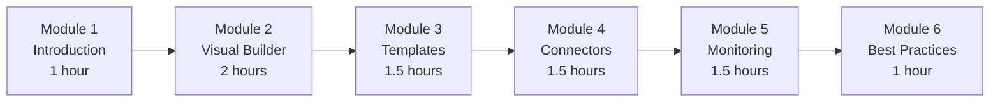
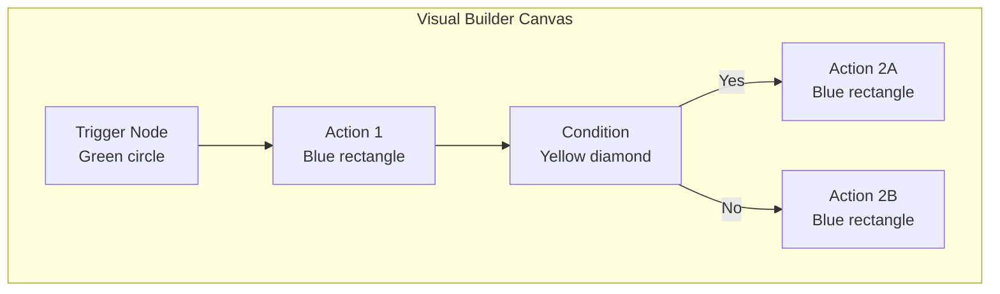
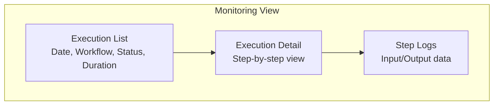

# Training Manual for End Users -- ERP-iPaaS
> Version: 1.0 | Last Updated: 2026-02-23 | Status: Draft
> Classification: Internal | Author: AIDD System

## 1. Training Overview

This training manual teaches business analysts and non-technical users how to create, manage, and monitor integrations using the ERP-iPaaS visual workflow builder and template marketplace.

## 2. Curriculum Structure

**Total Duration**: 8.5 hours (1.5 days)

## 3. Module 1: Introduction to Integration (1 hour)

### 3.1 Learning Objectives
- Understand what an integration platform does
- Identify common integration scenarios
- Navigate the ERP-iPaaS user interface

### 3.2 What is ERP-iPaaS?

ERP-iPaaS is the tool that connects different business systems together automatically. Instead of manually copying data between systems, you create "workflows" that do it for you.

**Real-world example**: When a new customer fills out a form on your website, ERP-iPaaS can automatically:
1. Create a contact in the CRM
2. Send a welcome email
3. Notify the sales team on Slack
4. Log the event for reporting

### 3.3 Key Concepts

| Concept | Description | Analogy |
|---------|-------------|---------|
| Workflow | A series of automated steps | A recipe in a cookbook |
| Trigger | What starts the workflow | The doorbell ringing |
| Action | A single step in the workflow | A cooking instruction |
| Connector | Connection to an external system | A power adapter |
| Template | Pre-built workflow | A recipe from a friend |

## 4. Module 2: Using the Visual Builder (2 hours)

### 4.1 Learning Objectives
- Create a simple workflow with trigger and actions
- Add conditional branching
- Test and activate workflows

### 4.2 The Workflow Canvas

### 4.3 Lab Exercises

**Lab 2.1**: Hello World workflow
1. Create a new workflow named "Hello World"
2. Add a Manual trigger
3. Add a "Send Slack Message" action
4. Configure: channel = #test, message = "Hello from iPaaS!"
5. Test the workflow
6. Verify the Slack message was sent

**Lab 2.2**: Lead notification workflow
1. Create a workflow with a Webhook trigger
2. Add "Transform Data" action to extract name and email
3. Add a conditional branch: if company size > 100, route to Enterprise Sales
4. Add "Send Email" action for each branch
5. Test with sample lead data

**Lab 2.3**: Scheduled report workflow
1. Create a workflow with a Schedule trigger (every day at 9 AM)
2. Add "Database Query" action to fetch yesterday's metrics
3. Add "Transform Data" to format as a table
4. Add "Send Email" action with the report

## 5. Module 3: Working with Templates (1.5 hours)

### 5.1 Learning Objectives
- Import and customize workflow templates
- Understand template categories
- Modify template configurations

### 5.2 Lab Exercises

**Lab 3.1**: Import "Lead Intake" template
1. Open Templates marketplace
2. Search for "Lead Intake"
3. Click "Use Template"
4. Review each step
5. Update the CRM URL and Slack webhook
6. Test with sample data

**Lab 3.2**: Import "Invoice to ERP" template
1. Import the Finance ETL template
2. Configure the source (Google Sheets or CSV upload)
3. Map fields to the finance module schema
4. Set schedule to daily
5. Activate

## 6. Module 4: Managing Connectors (1.5 hours)

### 6.1 Learning Objectives
- Browse and install connectors
- Configure connector authentication
- Use connectors in workflows

### 6.2 Lab Exercises

**Lab 4.1**: Install and configure a connector
1. Browse the Connector Marketplace
2. Find the "Slack" connector
3. Click "Install"
4. Click "Configure" and authorize via OAuth2
5. Use the connector in a new workflow

## 7. Module 5: Monitoring Integrations (1.5 hours)

### 7.1 Learning Objectives
- View execution history
- Interpret workflow statuses
- Troubleshoot common failures

### 7.2 Understanding the Monitoring Dashboard

### 7.3 Lab Exercises

**Lab 5.1**: Review execution history
1. Open the Monitor tab
2. Filter by "Last 24 hours"
3. Identify any failed executions
4. Click into a failed execution
5. Read the error message
6. Determine the root cause

**Lab 5.2**: Retry a failed execution
1. Open a failed execution
2. Click "Retry from failed step"
3. Verify the retry succeeds

## 8. Module 6: Best Practices (1 hour)

### 8.1 Workflow Design Best Practices
- Name workflows descriptively
- Add error handling (try/catch actions)
- Test with edge cases before activating
- Document what each workflow does
- Use templates as starting points

### 8.2 Common Mistakes to Avoid
- Forgetting to test before activating
- Hardcoding values instead of using variables
- Not handling errors (workflow fails silently)
- Creating too many workflows for the same purpose
- Not monitoring execution history

## 9. Assessment

**Practical Assessment**: Create a complete workflow that:
1. Triggers when a new form submission arrives (webhook)
2. Validates the email format
3. Creates a contact in the CRM
4. Sends a confirmation email
5. Notifies the team on Slack
6. Handles errors gracefully

**Passing Score**: Workflow executes successfully with all steps completing.
