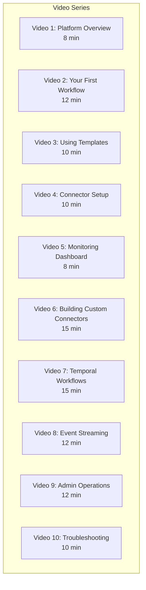

# Training Video Scripts -- ERP-iPaaS
> Version: 1.0 | Last Updated: 2026-02-23 | Status: Draft
> Classification: Internal | Author: AIDD System

## 1. Video Series Overview

This document contains scripts and outlines for 10 training videos covering ERP-iPaaS platform usage for administrators, end users, and developers.

**Total Runtime**: ~112 minutes

## 2. Video 1: Platform Overview (8 minutes)

### Script

**[0:00-0:30] Opening**

"Welcome to ERP-iPaaS, the integration backbone of the BillyRonks ERP platform. In this video, we will walk through the six core capabilities of the platform and show you how they work together to automate your business processes."

**[0:30-2:00] The Six Pillars**

_Screen: Architecture diagram animation_

"ERP-iPaaS consists of six core services. First, the Workflow Engine, which combines Activepieces for low-code visual workflows with Temporal for durable, code-first workflows. Second, the Connector Framework, which provides SDKs and a marketplace for connecting to external systems. Third, the Event Backbone built on Redpanda, providing real-time event streaming. Fourth, API Management via Traefik for gateway services. Fifth, the ETL Service for data pipeline management. And sixth, Webhook Management for incoming and outgoing webhook handling."

**[2:00-4:00] Who Uses It?**

_Screen: Persona cards_

"The platform serves three main user groups. Business analysts use the visual workflow builder to create integrations without writing code. Developers use the SDKs, APIs, and Temporal to build complex, custom integrations. And platform administrators manage tenants, security, and monitoring."

**[4:00-6:00] Live Demo: Dashboard Tour**

_Screen: Dashboard walkthrough_

"Let me show you the main dashboard. Here you can see the workflow execution rate, active connectors, event throughput, and system health. The left sidebar gives you access to Workflows, Connectors, Templates, Monitoring, and Settings."

**[6:00-7:30] Key Differentiators**

_Screen: Comparison table_

"What makes ERP-iPaaS unique compared to solutions like MuleSoft or Zapier? First, it is fully self-hosted on Kubernetes, giving you complete data sovereignty. Second, it combines low-code and pro-code in one platform. Third, it has built-in durable execution via Temporal. And fourth, it includes native event streaming via Redpanda."

**[7:30-8:00] Closing**

"In the next video, we will create our first workflow from scratch. See you there."

---

## 3. Video 2: Your First Workflow (12 minutes)

### Script

**[0:00-0:30] Opening**

"In this video, we will create a workflow from scratch using the visual builder. By the end, you will have a working integration that captures form submissions and notifies your team."

**[0:30-3:00] Creating the Workflow**

_Screen: Visual builder_

"Click 'New Workflow' and name it 'Form to Slack Notification'. Now let us add a trigger. Click the trigger node and select 'Webhook'. This generates a unique URL that external systems can POST data to."

**[3:00-5:00] Adding Actions**

_Screen: Action palette_

"Now drag the 'Transform Data' action from the palette onto the canvas. Connect it to the trigger. Click it and configure the field mapping: we will extract 'name', 'email', and 'company' from the incoming JSON."

**[5:00-7:00] Adding Conditional Logic**

_Screen: Condition node_

"Next, add a Condition node. We will check if the company field contains 'Enterprise'. If yes, we route to the enterprise sales notification. If no, we route to the standard notification."

**[7:00-9:00] Testing**

_Screen: Test panel_

"Click 'Test' and enter sample JSON data. Watch the execution flow through each step in real-time. Green checks indicate success. Let us verify the Slack message was delivered."

**[9:00-10:30] Activating**

_Screen: Activation toggle_

"Everything looks good. Toggle the workflow to 'Active'. Copy the webhook URL and configure your form provider to send data to this endpoint."

**[10:30-12:00] Recap and Next Steps**

"You have just created a complete workflow with a webhook trigger, data transformation, conditional branching, and Slack notification. In the next video, we will explore the template marketplace."

---

## 4. Video 3: Using Templates (10 minutes)

### Outline

| Timestamp | Content | Visual |
|-----------|---------|--------|
| 0:00-1:00 | Introduction to templates | Template marketplace |
| 1:00-3:00 | Browsing templates by category | Category filters |
| 3:00-5:00 | Importing "Lead Intake" template | Import wizard |
| 5:00-7:00 | Customizing template parameters | Configuration panel |
| 7:00-9:00 | Testing and activating | Test execution |
| 9:00-10:00 | Tips for choosing the right template | Summary slide |

---

## 5. Video 4: Connector Setup (10 minutes)

### Outline

| Timestamp | Content | Visual |
|-----------|---------|--------|
| 0:00-1:00 | What are connectors? | Connector concept |
| 1:00-3:00 | Browsing the marketplace | Marketplace UI |
| 3:00-5:00 | Installing a connector (Slack) | Install wizard |
| 5:00-7:00 | Configuring OAuth2 authentication | OAuth2 flow |
| 7:00-9:00 | Using the connector in a workflow | Builder integration |
| 9:00-10:00 | Managing connector credentials | Settings panel |

---

## 6. Video 5: Monitoring Dashboard (8 minutes)

### Outline

| Timestamp | Content | Visual |
|-----------|---------|--------|
| 0:00-1:00 | Why monitoring matters | Dashboard overview |
| 1:00-3:00 | Execution history view | Execution list |
| 3:00-5:00 | Drilling into a failed execution | Error detail |
| 5:00-7:00 | Grafana dashboard walkthrough | Grafana panels |
| 7:00-8:00 | Setting up email alerts | Alert configuration |

---

## 7. Video 6: Building Custom Connectors (15 minutes)

### Outline

| Timestamp | Content | Visual |
|-----------|---------|--------|
| 0:00-2:00 | Why build custom connectors | Use case overview |
| 2:00-5:00 | Scaffolding with connector-cli | Terminal |
| 5:00-8:00 | Implementing auth and actions | Code editor |
| 8:00-10:00 | Writing schemas | JSON Schema editor |
| 10:00-12:00 | Validation and testing | CLI output |
| 12:00-14:00 | Publishing to marketplace | Publish flow |
| 14:00-15:00 | Best practices | Summary |

---

## 8. Video 7: Temporal Workflows (15 minutes)

### Outline

| Timestamp | Content | Visual |
|-----------|---------|--------|
| 0:00-2:00 | When to use Temporal vs. Activepieces | Decision matrix |
| 2:00-5:00 | Writing a workflow function | Code editor |
| 5:00-8:00 | Implementing activities | Activity code |
| 8:00-10:00 | Configuring retry and timeout | Configuration |
| 10:00-12:00 | Human-in-the-loop with signals | Signal demo |
| 12:00-14:00 | Testing with TestWorkflowEnvironment | Test runner |
| 14:00-15:00 | Monitoring in Temporal Web UI | Temporal UI |

---

## 9. Video 8: Event Streaming (12 minutes)

### Outline

| Timestamp | Content | Visual |
|-----------|---------|--------|
| 0:00-2:00 | Event-driven architecture concepts | Diagram |
| 2:00-4:00 | Publishing events via API | API call |
| 4:00-6:00 | Schema registry management | Schema upload |
| 6:00-8:00 | Consuming events | Consumer code |
| 8:00-10:00 | Dead letter queues | DLQ management |
| 10:00-12:00 | CloudEvents specification | Event format |

---

## 10. Video 9: Admin Operations (12 minutes)

### Outline

| Timestamp | Content | Visual |
|-----------|---------|--------|
| 0:00-2:00 | Tenant provisioning | Keycloak + K8s |
| 2:00-4:00 | Security configuration | RBAC + API keys |
| 4:00-6:00 | Monitoring and alerting | Grafana + Prometheus |
| 6:00-8:00 | Scaling operations | KEDA + HPA |
| 8:00-10:00 | Backup and recovery | Backup procedures |
| 10:00-12:00 | Rolling updates via ArgoCD | GitOps flow |

---

## 11. Video 10: Troubleshooting (10 minutes)

### Outline

| Timestamp | Content | Visual |
|-----------|---------|--------|
| 0:00-2:00 | Common failure modes | Error examples |
| 2:00-4:00 | Using Grafana for investigation | Dashboard drill-down |
| 4:00-6:00 | Log search with Loki | Log query |
| 6:00-8:00 | Trace analysis with Tempo | Trace view |
| 8:00-9:00 | Webhook debugging | Delivery logs |
| 9:00-10:00 | When to escalate | Escalation matrix |

## 12. Production Requirements

| Requirement | Specification |
|------------|---------------|
| Format | MP4 (1080p) |
| Audio | Professional voiceover with transcript |
| Captions | English (auto-generated + reviewed) |
| Hosting | Internal LMS + YouTube (unlisted) |
| Screen recordings | OBS Studio or Loom |
| Editing | DaVinci Resolve or Adobe Premiere |
