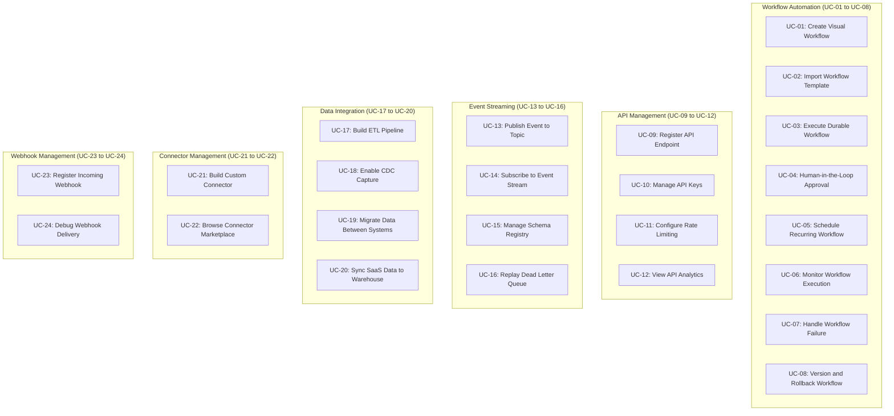
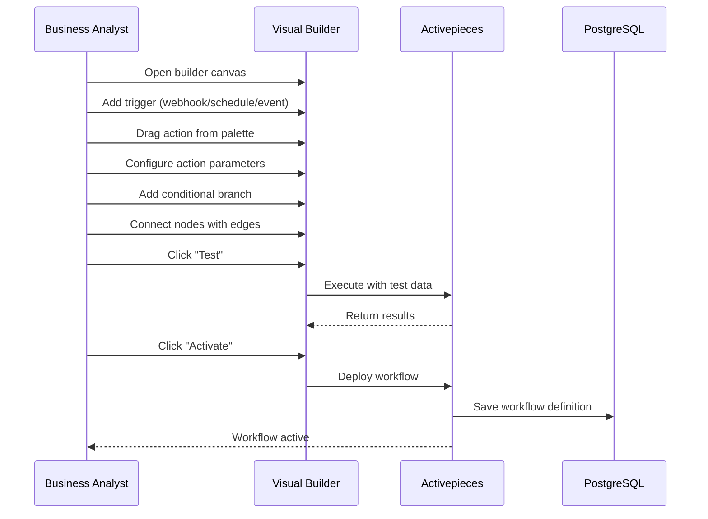
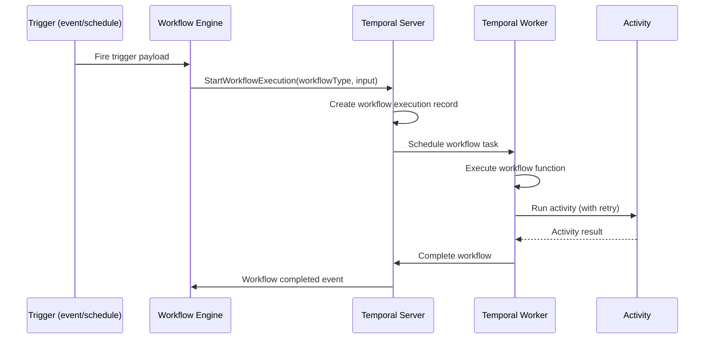
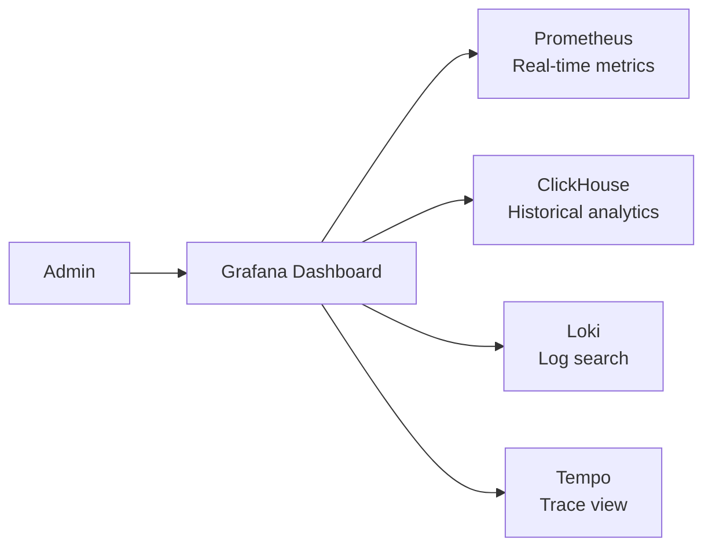
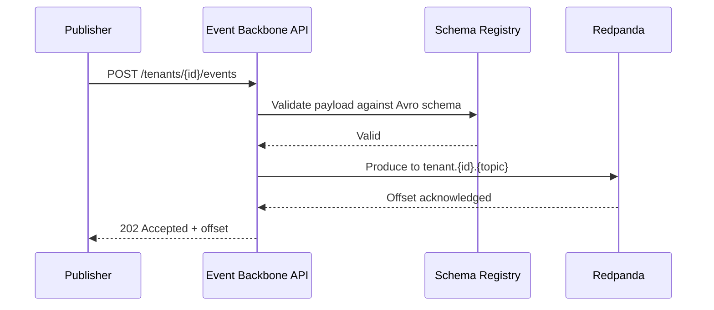
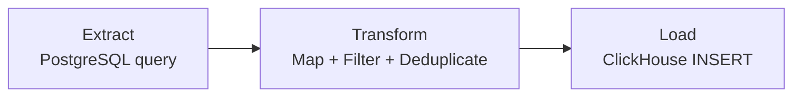
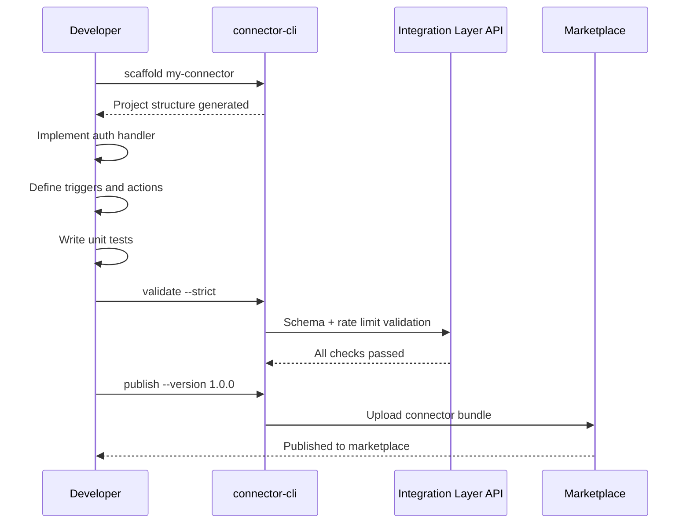
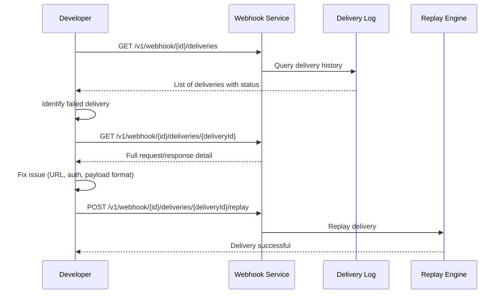

# Use Cases and Scenarios -- ERP-iPaaS
> Version: 1.0 | Last Updated: 2026-02-23 | Status: Draft
> Classification: Internal | Author: AIDD System

## 1. Overview

This document defines 24 use cases across six domains: workflow automation, API management, event streaming, data integration, connector management, and webhook management. Each use case includes actors, preconditions, flow, and expected outcomes.

## 2. Use Case Map

## 3. Workflow Automation Use Cases

### UC-01: Create Visual Workflow

| Field | Value |
|-------|-------|
| **ID** | UC-01 |
| **Title** | Create Visual Workflow |
| **Actor** | Business Analyst |
| **Preconditions** | User authenticated, tenant provisioned, Activepieces accessible |
| **Trigger** | User opens workflow builder |

**Main Flow**:

**Postconditions**: Workflow saved, trigger armed, ready for execution.

**Alternative Flows**:
- A1: Validation error -- UI highlights invalid connections
- A2: Test failure -- Error details displayed with retry option

---

### UC-02: Import Workflow Template

| Field | Value |
|-------|-------|
| **ID** | UC-02 |
| **Title** | Import Workflow Template |
| **Actor** | Business Analyst, Developer |
| **Preconditions** | Template marketplace accessible |

**Main Flow**:
1. User browses template marketplace (16 Activepieces + 7 Temporal templates)
2. User selects template (e.g., "Lead Intake")
3. System displays template preview with steps and required configurations
4. User clicks "Import"
5. System copies template to tenant workspace
6. User customizes parameters (API keys, URLs, field mappings)
7. User activates workflow

---

### UC-03: Execute Durable Workflow (Temporal)

| Field | Value |
|-------|-------|
| **ID** | UC-03 |
| **Title** | Execute Durable Workflow |
| **Actor** | System (automated trigger) |
| **Preconditions** | Temporal workflow registered, workers running |

**Main Flow**:

**Key Properties**:
- Activities retry up to 5 times with exponential backoff (2x coefficient)
- Heartbeat timeout: 30 seconds
- Start-to-close timeout: 5 minutes per activity
- Workflow survives worker/server restarts

---

### UC-04: Human-in-the-Loop Approval

| Field | Value |
|-------|-------|
| **ID** | UC-04 |
| **Title** | Human-in-the-Loop Approval |
| **Actor** | Approver (human), System |
| **Preconditions** | Workflow with approval step configured |

**Main Flow**:
1. Workflow reaches approval step
2. System sends notification to approver (Slack/email)
3. Workflow pauses (Temporal signal wait)
4. Approver reviews and clicks "Approve" or "Reject"
5. System sends signal to Temporal workflow
6. Workflow resumes with approval decision
7. Subsequent steps execute based on decision

---

### UC-05: Schedule Recurring Workflow

| Field | Value |
|-------|-------|
| **ID** | UC-05 |
| **Title** | Schedule Recurring Workflow |
| **Actor** | Business Analyst |
| **Preconditions** | Workflow created |

**Main Flow**:
1. User opens workflow settings
2. User selects "Schedule" trigger type
3. User enters cron expression (e.g., `0 9 * * MON-FRI` for weekday 9 AM)
4. System validates cron expression
5. System sets timezone (default: Africa/Lagos)
6. User activates schedule
7. System registers cron trigger with workflow engine

---

### UC-06: Monitor Workflow Execution

| Field | Value |
|-------|-------|
| **ID** | UC-06 |
| **Title** | Monitor Workflow Execution |
| **Actor** | Platform Administrator |

**Main Flow**:

Monitoring panels include:
- Execution rate per tenant/workflow
- Duration percentiles (p50, p95, p99)
- Error rate by workflow type
- Active execution count
- Temporal task queue depth
- Worker saturation ratio

---

### UC-07: Handle Workflow Failure

| Field | Value |
|-------|-------|
| **ID** | UC-07 |
| **Title** | Handle Workflow Failure with Retry and Compensation |
| **Actor** | System, Platform Administrator |

**Main Flow**:
1. Activity fails (network error, timeout, API error)
2. Temporal retries with exponential backoff (5s, 10s, 20s, 40s, 80s)
3. If all retries exhausted, workflow marks as failed
4. If saga pattern: compensation activities execute in reverse order
5. Failed event published to Redpanda
6. ClickHouse records failure metrics
7. Prometheus alert fires if error rate > 5%
8. Administrator investigates via Grafana dashboard

---

### UC-08: Version and Rollback Workflow

| Field | Value |
|-------|-------|
| **ID** | UC-08 |
| **Title** | Version and Rollback Workflow |
| **Actor** | Developer |

**Main Flow**:
1. Developer modifies workflow definition
2. System creates new version (semantic versioning)
3. Developer deploys new version
4. If issues detected, developer selects previous version
5. System restores previous workflow definition
6. Running executions on old version continue until completion

## 4. API Management Use Cases

### UC-09: Register API Endpoint

| Field | Value |
|-------|-------|
| **ID** | UC-09 |
| **Title** | Register API Endpoint in Gateway |
| **Actor** | Developer |

**Main Flow**:
1. Developer creates OpenAPI specification
2. Developer uploads spec to API management service
3. System validates specification
4. System generates gateway routes (Traefik IngressRoute)
5. System auto-generates documentation
6. Developer portal updates with new endpoint

---

### UC-10: Manage API Keys

| Field | Value |
|-------|-------|
| **ID** | UC-10 |
| **Title** | Create, Rotate, and Revoke API Keys |
| **Actor** | Developer, Administrator |

**Main Flow**:
1. User requests new API key with specified scopes
2. System generates key pair (public ID + secret)
3. Secret displayed once; hashed for storage
4. User configures key in client application
5. For rotation: new key generated, old key given grace period
6. For revocation: key immediately invalidated

---

### UC-11: Configure Rate Limiting

| Field | Value |
|-------|-------|
| **ID** | UC-11 |
| **Title** | Configure Per-Tenant Rate Limits |
| **Actor** | Platform Administrator |

**Main Flow**:
1. Admin selects tenant
2. Admin defines rate limit policy (requests per second/minute/hour/day)
3. Admin configures burst allowance
4. System applies Traefik middleware rate limiting
5. Rate limit responses return `429 Too Many Requests` with `Retry-After` header

---

### UC-12: View API Analytics

| Field | Value |
|-------|-------|
| **ID** | UC-12 |
| **Title** | View API Usage Analytics |
| **Actor** | Platform Administrator, Developer |

**Main Flow**:
1. User opens API analytics dashboard
2. Dashboard displays: request volume, latency distribution, error rates, top endpoints
3. User filters by tenant, time range, endpoint
4. User exports data for reporting

## 5. Event Streaming Use Cases

### UC-13: Publish Event to Topic

| Field | Value |
|-------|-------|
| **ID** | UC-13 |
| **Title** | Publish Event to Tenant-Scoped Kafka Topic |
| **Actor** | System, Developer |

**Main Flow**:

---

### UC-14: Subscribe to Event Stream

| Field | Value |
|-------|-------|
| **ID** | UC-14 |
| **Title** | Subscribe to Real-Time Event Stream |
| **Actor** | Developer, Workflow Engine |

**Main Flow**:
1. Consumer registers subscription to topic pattern
2. Redpanda assigns partitions to consumer group
3. Events delivered in order per partition
4. Consumer acknowledges processed events
5. Failed events routed to DLQ after retry exhaustion

---

### UC-15: Manage Schema Registry

| Field | Value |
|-------|-------|
| **ID** | UC-15 |
| **Title** | Upload and Manage Event Schemas |
| **Actor** | Developer |

**Main Flow**:
1. Developer uploads Avro or JSON Schema via API
2. Schema registry validates and assigns version
3. All producers must validate against registered schema
4. Backward-compatible evolution enforced (new fields must have defaults)
5. Schema versions browsable in developer portal

---

### UC-16: Replay Dead Letter Queue

| Field | Value |
|-------|-------|
| **ID** | UC-16 |
| **Title** | Replay Failed Events from DLQ |
| **Actor** | Platform Administrator |

**Main Flow**:
1. Admin identifies failed events in DLQ
2. Admin reviews failure reasons (schema mismatch, consumer error, timeout)
3. Admin fixes root cause (deploy fix, update schema)
4. Admin selects events for replay
5. System re-publishes events to original topic
6. Consumers reprocess events

## 6. Data Integration Use Cases

### UC-17: Build ETL Pipeline

| Field | Value |
|-------|-------|
| **ID** | UC-17 |
| **Title** | Build Extract-Transform-Load Pipeline |
| **Actor** | Data Engineer |

**Main Flow**:

1. Data engineer defines extraction source (database, API, file)
2. Data engineer configures transformation rules (field mapping, filtering, aggregation, deduplication)
3. Data engineer specifies load target (ClickHouse, PostgreSQL, API, MinIO)
4. Data engineer sets schedule (cron) or trigger (event-driven)
5. System executes pipeline and logs metrics

---

### UC-18: Enable CDC Capture

| Field | Value |
|-------|-------|
| **ID** | UC-18 |
| **Title** | Enable Change Data Capture via Debezium |
| **Actor** | Data Engineer |

**Main Flow**:
1. Data engineer selects source database and tables
2. System deploys Debezium connector for PostgreSQL
3. Debezium captures INSERT/UPDATE/DELETE operations
4. Changes published to Redpanda topic in real-time
5. Downstream consumers process change events

---

### UC-19: Migrate Data Between Systems

| Field | Value |
|-------|-------|
| **ID** | UC-19 |
| **Title** | One-Time Data Migration |
| **Actor** | Data Engineer |

**Main Flow**:
1. Engineer defines source system and extraction query
2. Engineer configures field mapping and data type conversions
3. Engineer runs validation pass (dry run)
4. System reports mapping conflicts and data quality issues
5. Engineer resolves issues and runs full migration
6. System tracks progress with checkpoint/resume capability

---

### UC-20: Sync SaaS Data to Warehouse

| Field | Value |
|-------|-------|
| **ID** | UC-20 |
| **Title** | Continuous SaaS-to-Warehouse Sync |
| **Actor** | Data Engineer |

**Main Flow**:
1. Engineer selects SaaS connector (e.g., Salesforce, Stripe)
2. Engineer authenticates via OAuth2
3. Engineer selects objects/tables to sync
4. Engineer configures sync frequency (every 15 min, hourly, daily)
5. System extracts incremental changes from SaaS API
6. System transforms and loads to ClickHouse/PostgreSQL
7. Dashboard shows sync status and row counts

## 7. Connector Management Use Cases

### UC-21: Build Custom Connector

| Field | Value |
|-------|-------|
| **ID** | UC-21 |
| **Title** | Build and Publish Custom Connector |
| **Actor** | Developer |

**Main Flow**:

---

### UC-22: Browse Connector Marketplace

| Field | Value |
|-------|-------|
| **ID** | UC-22 |
| **Title** | Discover and Install Connectors |
| **Actor** | Business Analyst, Developer |

**Main Flow**:
1. User opens connector marketplace
2. User browses by category (CRM, Finance, Communication, Data, DevOps)
3. User views connector details (rating, quality score, badges, SLO)
4. User clicks "Install"
5. System provisions connector for tenant
6. Connector available in workflow builder palette

## 8. Webhook Management Use Cases

### UC-23: Register Incoming Webhook

| Field | Value |
|-------|-------|
| **ID** | UC-23 |
| **Title** | Register Incoming Webhook Endpoint |
| **Actor** | Developer |

**Main Flow**:
1. Developer requests webhook URL via API
2. System generates unique URL with signing secret
3. Developer configures external system to POST to webhook URL
4. System validates signature on each incoming request
5. Validated payloads trigger associated workflows

---

### UC-24: Debug Webhook Delivery

| Field | Value |
|-------|-------|
| **ID** | UC-24 |
| **Title** | Debug Failed Webhook Deliveries |
| **Actor** | Developer |

**Main Flow**:

## 9. Cross-Domain Use Cases Summary

| ID | Use Case | Domain | Primary Actor |
|----|----------|--------|--------------|
| UC-01 | Create Visual Workflow | Workflow | Business Analyst |
| UC-02 | Import Workflow Template | Workflow | Business Analyst |
| UC-03 | Execute Durable Workflow | Workflow | System |
| UC-04 | Human-in-the-Loop Approval | Workflow | Approver |
| UC-05 | Schedule Recurring Workflow | Workflow | Business Analyst |
| UC-06 | Monitor Workflow Execution | Workflow | Administrator |
| UC-07 | Handle Workflow Failure | Workflow | System |
| UC-08 | Version and Rollback | Workflow | Developer |
| UC-09 | Register API Endpoint | API Management | Developer |
| UC-10 | Manage API Keys | API Management | Developer |
| UC-11 | Configure Rate Limiting | API Management | Administrator |
| UC-12 | View API Analytics | API Management | Administrator |
| UC-13 | Publish Event | Event Streaming | System |
| UC-14 | Subscribe to Stream | Event Streaming | Developer |
| UC-15 | Manage Schema Registry | Event Streaming | Developer |
| UC-16 | Replay Dead Letter Queue | Event Streaming | Administrator |
| UC-17 | Build ETL Pipeline | Data Integration | Data Engineer |
| UC-18 | Enable CDC Capture | Data Integration | Data Engineer |
| UC-19 | Migrate Data | Data Integration | Data Engineer |
| UC-20 | Sync SaaS to Warehouse | Data Integration | Data Engineer |
| UC-21 | Build Custom Connector | Connectors | Developer |
| UC-22 | Browse Marketplace | Connectors | Business Analyst |
| UC-23 | Register Webhook | Webhooks | Developer |
| UC-24 | Debug Webhook Delivery | Webhooks | Developer |
