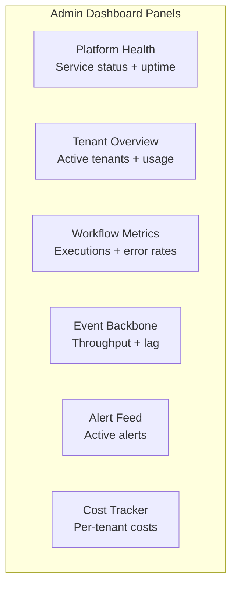
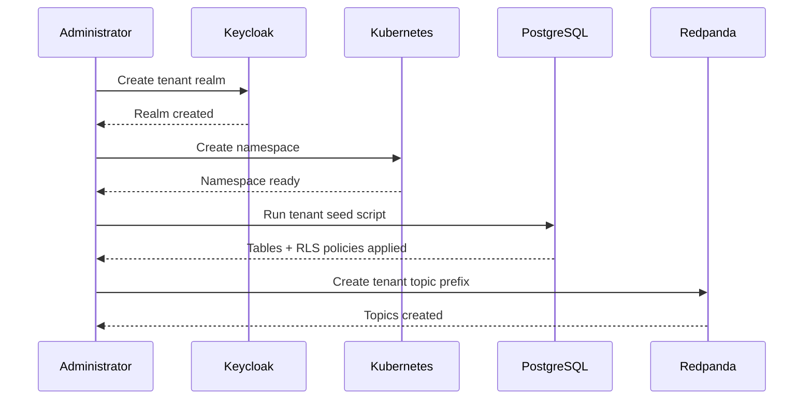

# User Manual for Administrators -- ERP-iPaaS
> Version: 1.0 | Last Updated: 2026-02-23 | Status: Draft
> Classification: Internal | Author: AIDD System

## 1. Introduction

This manual provides comprehensive guidance for platform administrators responsible for managing, monitoring, and maintaining the ERP-iPaaS integration platform. Administrators handle tenant provisioning, security configuration, monitoring, and incident response.

## 2. Administrator Dashboard

### 2.1 Accessing the Admin Console

1. Navigate to `https://admin.<DOMAIN>/ipaas`
2. Authenticate via Keycloak SSO (requires `integration_admin` role)
3. Select your tenant context from the tenant picker

### 2.2 Dashboard Overview



## 3. Tenant Management

### 3.1 Provisioning a New Tenant



**Steps**:
1. Create Keycloak realm for the tenant
2. Configure OAuth2 client credentials
3. Create Kubernetes namespace: `kubectl create namespace tenant-{id}`
4. Apply RLS policies: Execute `config/security/postgres_rls.sql`
5. Create Redpanda topics with tenant prefix
6. Seed workflow templates: `scripts/seed.sh --tenant {id}`
7. Configure KEDA scaled objects for the tenant

### 3.2 Tenant Configuration

| Setting | Description | Default |
|---------|-------------|---------|
| Tier | Starter/Professional/Enterprise/Dedicated | Professional |
| Max workflows | Maximum active workflows | 100 |
| Max executions/day | Daily execution limit | 100,000 |
| Max events/sec | Event throughput limit | 5,000 |
| Data retention | Days to retain execution data | 30 |
| Timezone | Default timezone | Africa/Lagos |

### 3.3 Tenant Deprovisioning

1. Disable all active workflows
2. Wait for in-flight executions to complete
3. Export audit logs for compliance
4. Delete Kubernetes namespace
5. Remove Keycloak realm
6. Clean ClickHouse data (tenant_id filter)

## 4. Security Administration

### 4.1 Managing API Keys

**Create API Key**:
```bash
curl -X POST https://api.<DOMAIN>/integration/tenants/{id}/secrets \
  -H "Authorization: Bearer $TOKEN" \
  -d '{"name":"production-api-key","description":"Prod key","payload":{"key":"..."},"rotationPeriodDays":90}'
```

**Rotate API Key**:
1. Generate new key via Secrets API
2. Update client applications with new key
3. Old key remains valid for grace period (configurable)
4. Revoke old key after migration

### 4.2 Reviewing Audit Logs

Query ClickHouse for audit events:
```sql
SELECT actor, action, resource_type, resource_id, timestamp
FROM billyronks.audit
WHERE tenant_id = '{tenant-id}'
  AND timestamp > now() - INTERVAL 7 DAY
ORDER BY timestamp DESC
LIMIT 100;
```

### 4.3 Managing Roles and Permissions

Roles are managed in Keycloak:
1. Navigate to Keycloak admin console
2. Select tenant realm
3. Go to Roles section
4. Assign roles to users: `integration_admin`, `workflow_editor`, `workflow_viewer`, `connector_author`, `data_engineer`, `developer`, `auditor`

## 5. Monitoring and Alerting

### 5.1 Grafana Dashboards

Access Grafana at `https://grafana.<DOMAIN>` (port 3000 in dev).

**Key Dashboards**:
- **WaaS Overview**: Workflow execution rate, duration, error rate
- **Event Backbone**: Redpanda throughput, consumer lag, partition health
- **Connector Health**: Latency heatmap, error rates by connector
- **Tenant Usage**: Per-tenant execution counts, costs, quotas

### 5.2 Alert Management

Five pre-configured alerts in `config/prometheus/rules/waas-alerts.yaml`:

| Alert | Threshold | Severity | Action Required |
|-------|----------|----------|----------------|
| ActivepiecesWorkerSaturation | > 80% busy for 5m | Warning | Scale workers |
| TemporalTaskBacklog | > 1000 tasks for 10m | Critical | Scale workers + investigate |
| KafkaLagHigh | > 5000 for 10m | Warning | Check consumer health |
| ApiErrorRate | > 5% 5xx for 5m | Critical | Investigate failing service |
| TenantCostSpike | > $100/hr for 15m | Info | Review tenant activity |

### 5.3 Scaling Operations

**Manual Scaling**:
```bash
kubectl scale deployment workflow-engine --replicas=4 -n ipaas-system
```

**KEDA Auto-Scaling**: Configured via `infrastructure/helm/keda/templates/scaledobject.yaml`. Scales based on:
- Kafka consumer lag
- Temporal task queue depth
- HTTP request queue depth

## 6. Backup and Recovery

### 6.1 Backup Strategy

| Component | Backup Method | Frequency | Retention |
|-----------|-------------|-----------|-----------|
| PostgreSQL | pg_dump + WAL archiving | Continuous | 30 days |
| ClickHouse | clickhouse-backup | Daily | 90 days |
| Redpanda | Topic snapshots | Daily | 7 days |
| MinIO | Site replication | Real-time | Configurable |
| Kubernetes | etcd snapshots | Hourly | 7 days |

### 6.2 Disaster Recovery

| Scenario | RTO | RPO | Procedure |
|----------|-----|-----|-----------|
| Single pod failure | < 30s | 0 | Kubernetes auto-restart |
| Node failure | < 5m | 0 | Pod rescheduling |
| Database failure | < 15m | < 5m | Promote replica |
| Full cluster failure | < 1h | < 5m | Restore from backup |

## 7. Maintenance Procedures

### 7.1 Routine Maintenance Checklist

- [ ] Review Grafana dashboards daily
- [ ] Check for pending alerts in Prometheus
- [ ] Verify backup completion
- [ ] Review ClickHouse storage usage
- [ ] Check certificate expiration dates
- [ ] Review tenant quota utilization
- [ ] Update Helm charts when new versions available

### 7.2 Rolling Updates

```bash
# Update a service (zero-downtime)
helm upgrade --install workflow-engine ./infra/helm/workflow-engine \
  --set image.tag=v1.2.0 \
  --namespace ipaas-system
```

ArgoCD automates this via GitOps: commit changes to Helm values, ArgoCD syncs automatically.
