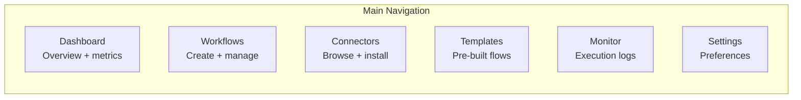
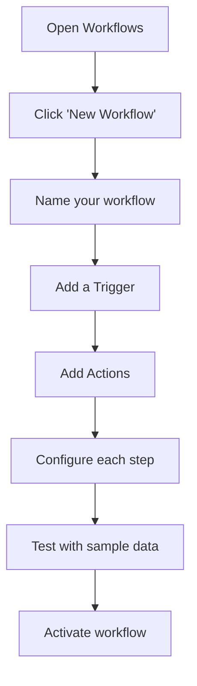

# User Manual for End Users -- ERP-iPaaS
> Version: 1.0 | Last Updated: 2026-02-23 | Status: Draft
> Classification: Internal | Author: AIDD System

## 1. Introduction

This manual guides business analysts and non-technical users through the ERP-iPaaS platform, focusing on creating workflows using the visual builder, importing templates, managing connectors, and monitoring integrations.

## 2. Getting Started

### 2.1 Logging In

1. Open your browser and navigate to the ERP-iPaaS portal
2. Click "Sign In" and authenticate with your company credentials (SSO)
3. Select your workspace/tenant from the dropdown
4. You will land on the Integration Studio dashboard

### 2.2 Navigation

## 3. Creating Your First Workflow

### 3.1 Using the Visual Builder

**Step-by-step**:

1. **Open Workflows**: Click "Workflows" in the left sidebar
2. **New Workflow**: Click the "+" button or "New Workflow"
3. **Name It**: Give your workflow a descriptive name (e.g., "New Lead to CRM + Slack")
4. **Add Trigger**: Choose how the workflow starts:
   - **Webhook**: Triggered by an external event
   - **Schedule**: Runs on a cron schedule
   - **Event**: Triggered by a platform event
   - **Manual**: Triggered by clicking "Run"
5. **Add Actions**: Drag actions from the palette onto the canvas
6. **Connect Steps**: Draw lines between trigger and actions to define the flow
7. **Configure**: Click each step to set parameters (URLs, field mappings, credentials)
8. **Test**: Click "Test" to run with sample data
9. **Activate**: Toggle the workflow to "Active"

### 3.2 Supported Trigger Types

| Trigger | Description | Example |
|---------|-------------|---------|
| Webhook | External system sends data to a URL | Stripe sends payment event |
| Schedule | Runs at specified intervals | Every Monday at 9 AM |
| Event | Platform event triggers the flow | New CRM lead created |
| Polling | Checks a source periodically | Check email inbox every 5 min |
| Manual | Run on demand | User clicks "Execute" |

### 3.3 Common Action Types

| Action | Description |
|--------|-------------|
| HTTP Request | Call any REST API |
| Send Email | Send notification emails |
| Send Slack Message | Post to a Slack channel |
| Database Query | Read/write to databases |
| Transform Data | Map, filter, or format data |
| Conditional Branch | If/else logic |
| Loop | Iterate over a list |
| Delay | Wait for a specified time |
| Human Approval | Pause for manual approval |

## 4. Using Templates

### 4.1 Browsing the Template Marketplace

1. Click "Templates" in the sidebar
2. Browse by category: CRM, Finance, DevOps, Marketing, Data, etc.
3. Click a template to preview its steps and required configurations
4. Click "Use Template" to import it into your workspace

### 4.2 Available Templates

| Template | Description | Steps |
|----------|-------------|-------|
| Lead Intake | Capture leads, enrich via LLM, notify sales | 3 |
| Invoice to ERP | Process invoices and sync to finance module | 4 |
| HR Onboarding | Automate new employee onboarding | 5 |
| Support Triage | Classify tickets via AI and route | 4 |
| Finance ETL | Extract financial data to analytics | 3 |
| Commerce Order Ops | Process orders across modules | 5 |
| PR Quality Gate | Validate pull requests in CI/CD | 4 |
| Alerting On-Call | Route alerts to on-call engineers | 3 |

### 4.3 Customizing Templates

After importing a template:
1. Click on each step to review its configuration
2. Update credentials (API keys, OAuth2 connections)
3. Modify field mappings to match your data schema
4. Add or remove steps as needed
5. Test the modified workflow
6. Activate when satisfied

## 5. Managing Connectors

### 5.1 Browsing the Connector Marketplace

1. Click "Connectors" in the sidebar
2. Search by name or browse by category
3. Each connector shows: name, rating, quality score, badges, version
4. Click "Install" to add a connector to your workspace

### 5.2 Configuring Connector Authentication

After installing a connector:
1. Click "Configure" on the connector
2. Select authentication type:
   - **OAuth2**: Click "Connect" to authorize via the external service
   - **API Key**: Enter your API key
   - **Basic Auth**: Enter username and password
3. Test the connection
4. Save credentials (encrypted and stored securely)

### 5.3 Using Connectors in Workflows

Once configured, connectors appear in the action palette of the workflow builder. Drag a connector action onto the canvas to use it in your workflow.

## 6. Monitoring Your Integrations

### 6.1 Execution History

1. Click "Monitor" in the sidebar
2. View all workflow executions with status (running, completed, failed)
3. Click an execution to see step-by-step details
4. View input/output data for each step
5. See duration and trace information

### 6.2 Understanding Statuses

| Status | Icon | Description |
|--------|------|-------------|
| Running | Blue spinner | Workflow is executing |
| Completed | Green check | All steps succeeded |
| Failed | Red X | One or more steps failed |
| Waiting | Yellow clock | Awaiting human approval |
| Cancelled | Grey circle | Manually cancelled |

### 6.3 Troubleshooting Failed Executions

1. Open the failed execution
2. Find the step marked with red
3. Click to expand error details
4. Review the error message and response data
5. Common fixes:
   - **401 Unauthorized**: Re-authenticate the connector
   - **429 Too Many Requests**: Reduce workflow frequency
   - **Timeout**: Increase step timeout or check target system
6. After fixing, click "Retry" to re-run from the failed step

## 7. Webhook Management

### 7.1 Creating an Incoming Webhook

1. Go to Settings > Webhooks
2. Click "New Webhook"
3. Give it a name and select the associated workflow
4. Copy the generated webhook URL
5. Configure the external system to POST data to this URL

### 7.2 Testing Webhooks

1. Click "Test" on your webhook
2. Send a sample payload using the built-in tester
3. View the received payload and workflow execution
4. Verify the workflow processed the data correctly

## 8. Best Practices

1. **Start with templates**: Use pre-built templates and customize rather than building from scratch
2. **Test before activating**: Always test workflows with sample data before going live
3. **Use descriptive names**: Name workflows and steps clearly for team collaboration
4. **Monitor regularly**: Check the execution dashboard weekly for failures
5. **Keep credentials updated**: Rotate API keys and OAuth tokens before they expire
6. **Use conditional branches**: Add error handling with if/else to handle edge cases
