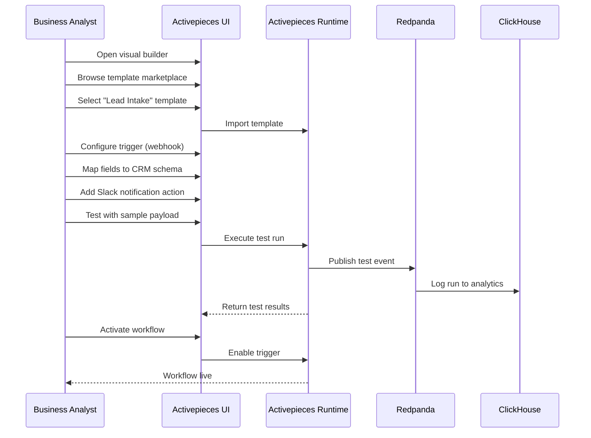
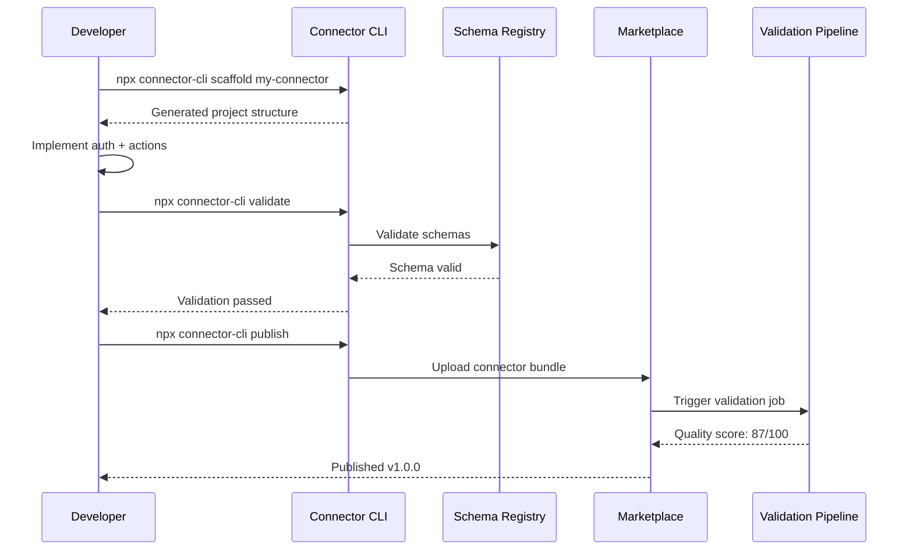
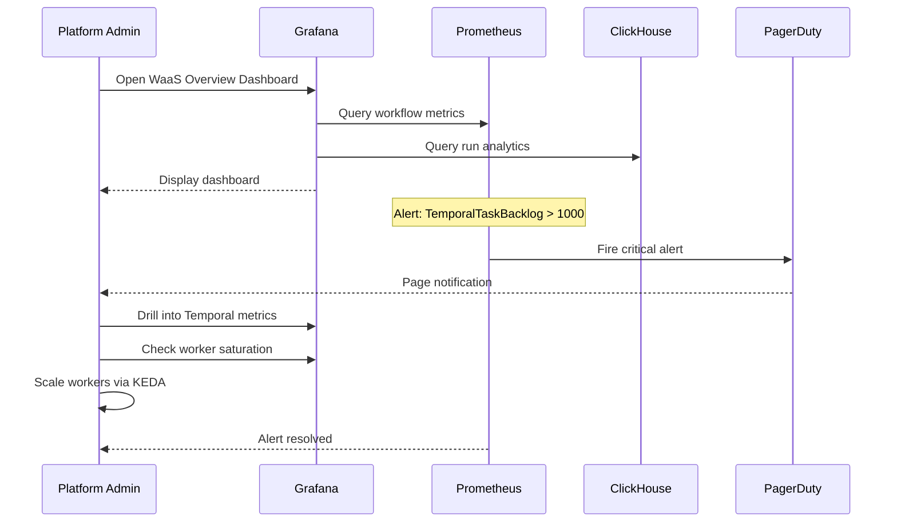
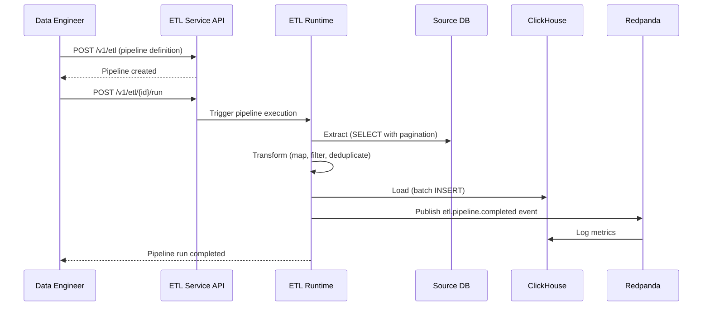
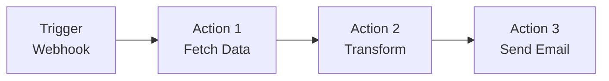
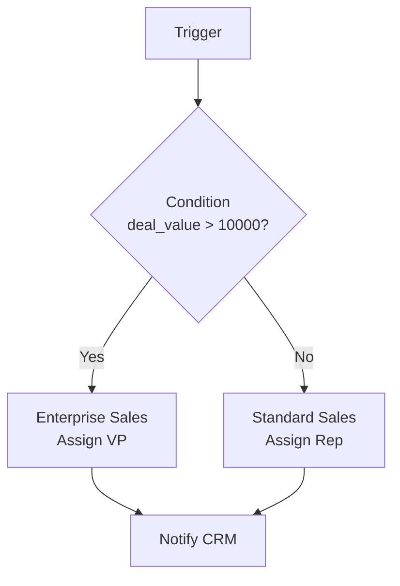
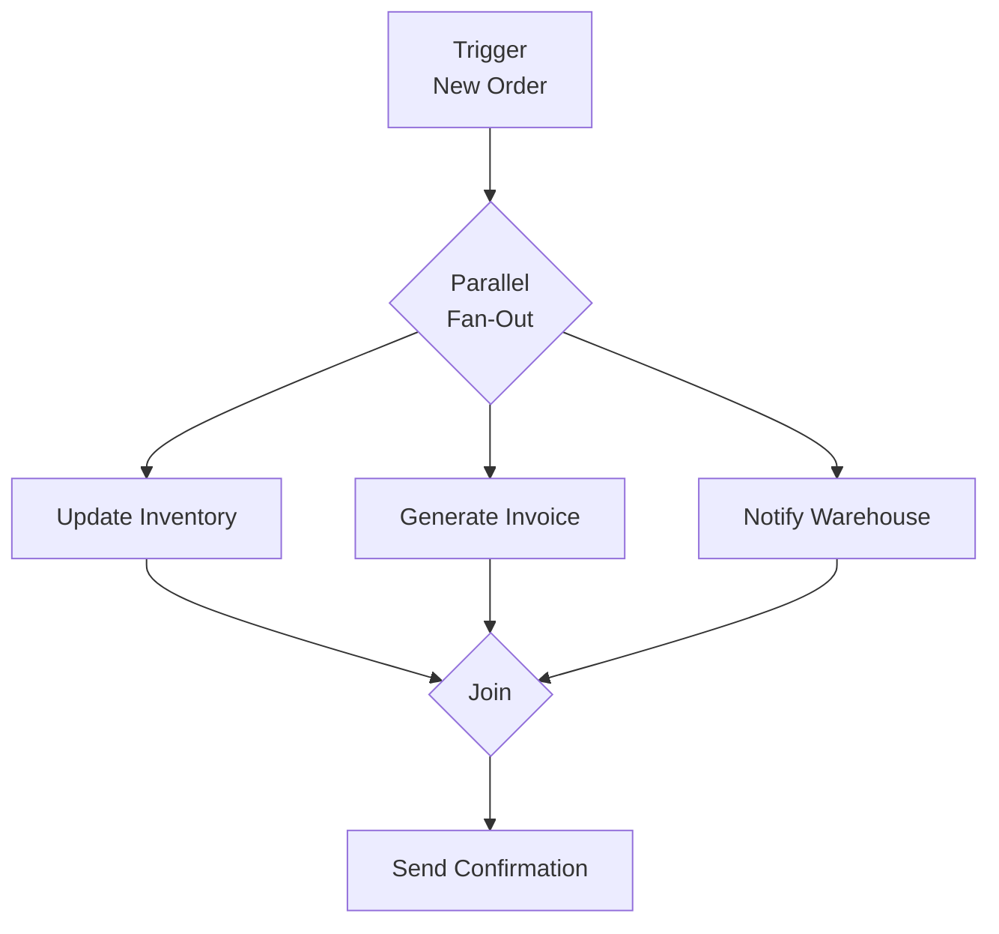
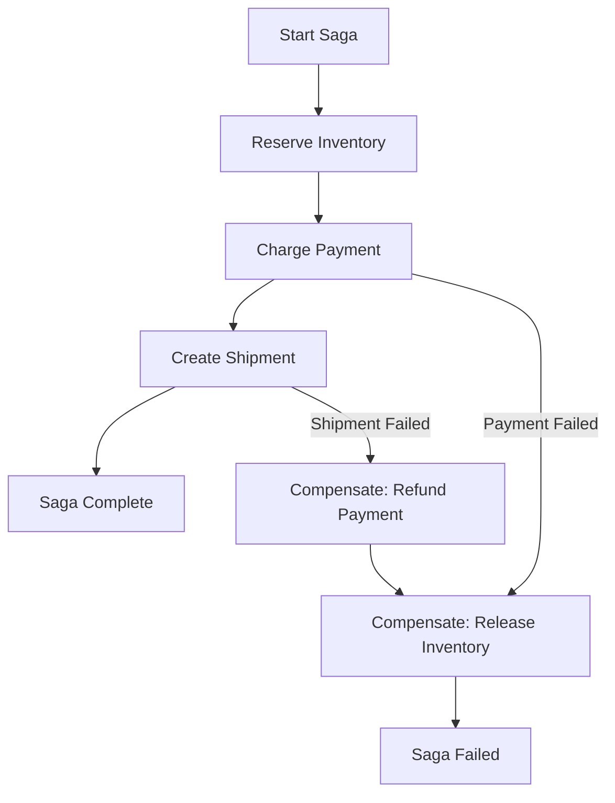
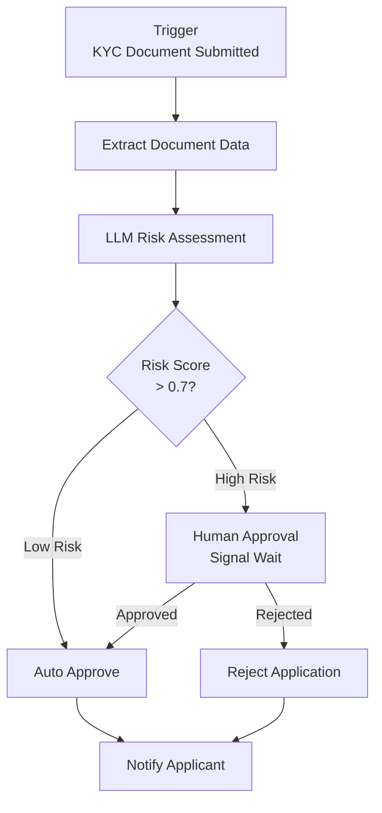
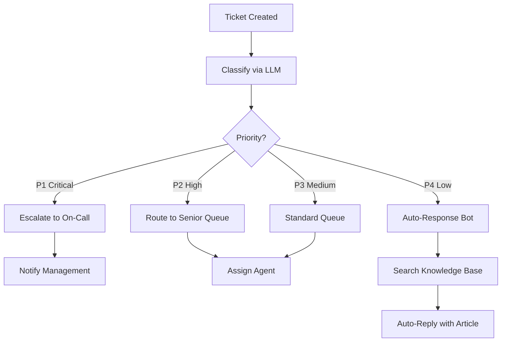

# Workflows and User Journeys -- ERP-iPaaS
> Version: 1.0 | Last Updated: 2026-02-23 | Status: Draft
> Classification: Internal | Author: AIDD System

## 1. Overview

ERP-iPaaS provides 23+ pre-built workflow templates across two runtime engines (Activepieces and Temporal), covering lead management, support operations, finance, HR, commerce, data engineering, and DevOps workflows.

## 2. Workflow Template Inventory

### 2.1 Activepieces Templates (16)

| # | Template | File | Category |
|---|---------|------|----------|
| 1 | Lead Intake | `lead-intake.json` | CRM |
| 2 | PR Quality Gate | `pr-quality-gate.json` | DevOps |
| 3 | Sheet-to-DB Sync | `sheet-db-sync.json` | Data |
| 4 | Marketing Syndication | `marketing-syndication.json` | Marketing |
| 5 | Support Triage | `support-triage.json` | Support |
| 6 | Commerce Order Ops | `commerce-order-ops.json` | Commerce |
| 7 | Social Listening | `social-listening.json` | Marketing |
| 8 | Finance ETL | `finance-etl.json` | Finance |
| 9 | Calendar Brief | `calendar-brief.json` | Productivity |
| 10 | Data Lake Ingest | `data-lake-ingest.json` | Data |
| 11 | Alerting On-Call | `alerting-oncall.json` | DevOps |
| 12 | Invoice to ERP | `invoice-to-erp.json` | Finance |
| 13 | HR Onboarding | `hr-onboarding.json` | HCM |
| 14 | KYC Intake | `kyc-intake.json` | Compliance |
| 15 | Rate Limit Shield | `rate-limit-shield.json` | Platform |
| 16 | Batch to Streaming | `batch-to-streaming.json` | Data |

### 2.2 Temporal Templates (7)

| # | Template | File | Category |
|---|---------|------|----------|
| 17 | Lead Intake (durable) | `lead-intake.json` | CRM |
| 18 | Support Escalation | `support-escalation.json` | Support |
| 19 | KYC Approval | `kyc-approval.json` | Compliance |
| 20 | On-Call Escalation | `oncall-escalation.json` | DevOps |
| 21 | Rate Limit Shield | `rate-limit-shield.json` | Platform |
| 22 | Invoice Reconciliation | `invoice-reconciliation.json` | Finance |
| 23 | Usage Aggregation | `usage-aggregation.json` | Billing |

## 3. Core User Journeys

### 3.1 Journey: Business Analyst Creates a Workflow



### 3.2 Journey: Developer Builds a Custom Connector



### 3.3 Journey: Platform Admin Monitors Integrations



### 3.4 Journey: Data Engineer Builds ETL Pipeline



## 4. Workflow Architecture Patterns

### 4.1 Simple Sequential Workflow



### 4.2 Conditional Branching Workflow



### 4.3 Parallel Fan-Out Workflow



### 4.4 Durable Saga Workflow (Temporal)



### 4.5 Human-in-the-Loop Workflow



## 5. Workflow Template Details

### 5.1 Lead Intake Workflow (Temporal)

```typescript
export async function leadIntakeWorkflow(input: LeadIntakeInput) {
  // Step 1: Upsert lead in CRM
  await upsertLeadActivity({
    tenantId: input.tenantId,
    crmBaseUrl: process.env.CRM_BASE_URL,
    token: process.env.CRM_TOKEN,
    payload: input.lead,
  });

  // Step 2: Generate summary via LLM
  const summary = await llmActivity({
    tenantId: input.tenantId,
    type: 'marketing-copy',
    instructions: 'Generate a friendly summary for sales team.',
    context: input.lead,
  });

  // Step 3: Notify sales channel
  await notifyChannel({
    tenantId: input.tenantId,
    channel: 'slack',
    endpoint: input.slackWebhook,
    message: `New lead captured: ${summary.headline}`,
    metadata: summary,
  });
}
```

### 5.2 Support Triage Workflow



## 6. Workflow Monitoring

### 6.1 Prometheus Alert Rules

| Alert | Condition | Severity |
|-------|----------|----------|
| ActivepiecesWorkerSaturation | Busy ratio > 80% for 5m | Warning |
| TemporalTaskBacklog | Backlog > 1000 for 10m | Critical |
| KafkaLagHigh | Consumer lag > 5000 for 10m | Warning |
| ApiErrorRate | 5xx rate > 5% for 5m | Critical |
| TenantCostSpike | Cost increase > $100/hr for 15m | Info |

### 6.2 Grafana Dashboard Panels

The WaaS Overview dashboard (`config/grafana/dashboards/waas-overview.json`) includes:
- Workflow execution rate (per tenant, per type)
- Execution duration percentiles (p50, p95, p99)
- Error rate by workflow
- Active workflow count
- Temporal task queue depth
- Kafka consumer lag
- Connector latency heatmap
