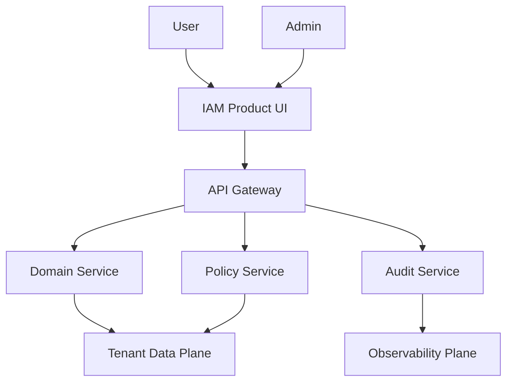
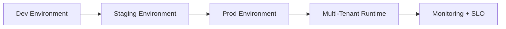

# IAM Architecture Category-King Blueprint

## Architecture Intent

This document defines the System and Service architecture for **IAM** with strict Tenant and Org isolation and scalable Environment promotion.

## Context Diagram

## Container and Service Boundaries

- **UI Container:** workflow composition, policy-aware rendering, realtime updates.
- **API Container:** contract boundary, auth context, rate limit and idempotency.
- **Domain Service:** project-specific business logic and invariants.
- **Policy Service:** RBAC/ABAC checks, Org policy resolution, Admin override logging.
- **Audit Service:** append-only event history with traceability guarantees.

## Deployment Topology

## API and Data Contract Rules

- All API operations include Org and Tenant context.
- Every mutating action emits an audit event with actor, scope, and correlation id.
- Pagination, filtering, and sorting are mandatory for list endpoints.
- Backward-compatible API evolution via additive contracts and version governance.

## Reliability and Resilience

- Active health checks across UI, API, and domain Service boundaries.
- Circuit-breaker and retry policy for transient dependencies.
- Runbook-linked alerts for saturation, errors, and latency SLO breaches.

## Security and Compliance Hooks

- OAuth2/JWT with least-privilege role scopes.
- Encryption in transit and at rest, key rotation policy.
- Compliance evidence streams mapped to control owners.

## Scalability Plan

- Horizontal scale on stateless layers.
- Queue-based async processing for expensive workflows.
- Hot-path caching with strict invalidation semantics.

## Architecture Review Checklist

1. Are System boundaries explicit for Product, API, and Service layers?
2. Is Tenant isolation enforced at read and write boundaries?
3. Are Admin actions fully auditable with rollback paths?
4. Are Environment promotion and release gates unambiguous?
