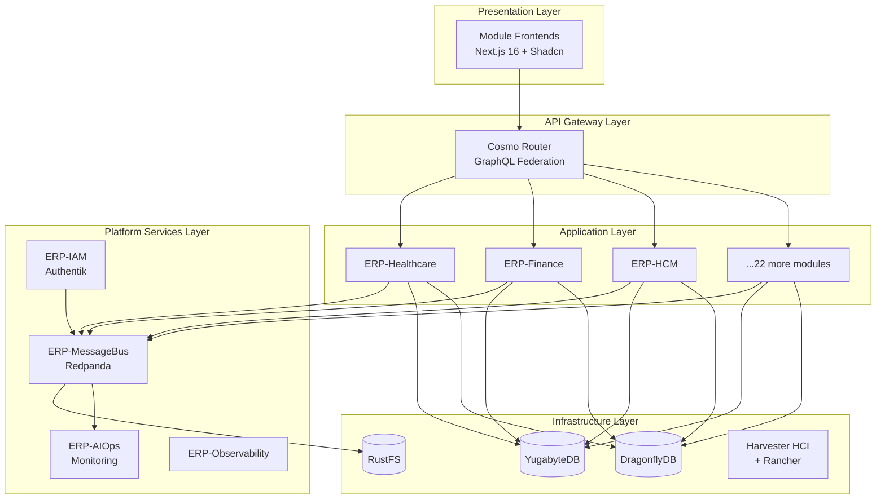

# Enterprise Architecture Roadmap

**Product**: ERP-MessageBus
**Version**: 1.0
**Date**: 2026-03-03

---

## 1. Enterprise Context

ERP-MessageBus is a foundational platform service within the Sovereign ERP 2026 ecosystem. It sits at the infrastructure layer and is consumed by all 25 application modules.

### Enterprise Architecture Positioning



## 2. Shared Platform Standards

| Standard | Technology | Owner |
|----------|-----------|-------|
| Identity & SSO | Authentik (OIDC/SAML) | ERP-IAM |
| Event Streaming | Redpanda (Kafka-compatible) | ERP-MessageBus |
| Database | YugabyteDB (distributed PostgreSQL) | shared-infra |
| Cache | DragonflyDB (Redis-compatible) | shared-infra |
| Object Storage | RustFS (S3-compatible) | shared-infra |
| GraphQL Gateway | Cosmo Router (federation) | shared-infra |
| Realtime | Centrifugo (WebSocket) | shared-infra |
| Container Platform | Harvester HCI + Rancher + Fleet | Platform team |
| Observability | Prometheus + Grafana + Tempo | ERP-Observability |
| AIOps | ERP-AIOps (incident + remediation) | ERP-AIOps |

## 3. Integration Points

### ERP-MessageBus Integrations

| Integration | Direction | Protocol | Purpose |
|-------------|-----------|----------|---------|
| All 25 modules → Redpanda | Produce | Kafka (SASL/SCRAM) | Event publishing |
| Redpanda → All 25 modules | Consume | Kafka (SASL/SCRAM) | Event subscription |
| YugabyteDB → Connect → Redpanda | CDC | PostgreSQL replication + Connect | Change data capture |
| Redpanda → RustFS | Tiered storage | S3 (shadow indexing) | Cold segment offload |
| Authentik → Console | OIDC | HTTP | SSO for Console UI |
| Redpanda → ERP-AIOps | Consume | Kafka | Health + audit events |
| Redpanda → ERP-Observability | Metrics | Prometheus scrape | Cluster metrics |

## 4. Data Model Alignment

All events flowing through ERP-MessageBus use the standard envelope:

```json
{
  "event_id": "uuid-v7",
  "event_type": "entity.action",
  "source": "erp-<module>",
  "tenant_id": "tnt_xxx",
  "timestamp": "2026-03-03T10:00:00Z",
  "data": { },
  "metadata": {
    "correlation_id": "uuid",
    "causation_id": "uuid",
    "schema_version": "1.0.0"
  }
}
```

## 5. Phased Roadmap

| Phase | Timeline | Deliverables | Dependencies |
|-------|----------|-------------|--------------|
| **Phase 1: Foundation** | Q1 2026 (complete) | Shared cluster, topic catalog, SASL, ACLs, Console OIDC | shared-infra |
| **Phase 2: Migration** | Q2 2026 | All 25 modules migrated to shared cluster; legacy brokers decommissioned | Module teams |
| **Phase 3: Advanced Governance** | Q3 2026 | Schema Registry, auto-topic provisioning, cross-module subscriptions | Schema tooling |
| **Phase 4: Intelligence** | Q4 2026 | Data quality scoring, auto-scaling Connect, usage analytics | ERP-AIOps, ERP-BI |

## 6. Governance Model

| Decision Area | Authority | Process |
|---------------|-----------|---------|
| Topic creation/naming | Platform Engineering | PR review against naming convention |
| ACL grants (same module) | Module Team Lead | Self-service via PR |
| ACL grants (cross-module) | Platform Engineering | PR + Security review |
| Quota changes | Platform Engineering | Capacity review + approval |
| Connect pipeline deployment | Module Team Lead + Platform review | PR + CI validation |
| Schema evolution | Module Team Lead | Compatibility check in CI |

---

**Dependencies**: [BRD](./BRD.md), [PRD](./PRD.md)
**Next**: [Project-Charter](./Project-Charter.md) → [Architecture](../01-architecture/SAD.md)
