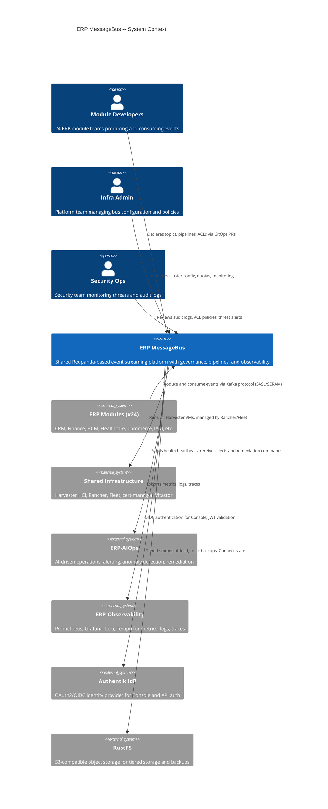

# Software Architecture Document (SAD) -- ERP MessageBus

## 1. Purpose and Scope

This document defines the software architecture for the **ERP MessageBus** platform -- the shared event-streaming backbone that connects all 24 ERP modules in a multi-tenant SaaS environment. The MessageBus provides centralized message brokering, event routing, schema governance, and audit-grade data pipelines.

**Scope:** This SAD covers the Redpanda-based message bus, Redpanda Console, Redpanda Connect (stream processing farm), tiered storage via RustFS, metadata persistence in YugabyteDB, caching in DragonflyDB, and all supporting infrastructure deployed on Harvester HCI managed by Rancher and Fleet.

**Audience:** Platform architects, infrastructure engineers, module developers, security reviewers, and SRE teams.

---

## 2. Architectural Principles

| # | Principle | Rationale |
|---|-----------|-----------|
| P1 | **Multi-Tenancy by Default** | Every topic, ACL, consumer group, and pipeline is scoped to `tenant_id`. Cross-tenant data leakage is treated as a Sev-1 incident. |
| P2 | **Event-Driven Integration** | Modules communicate via asynchronous events on Redpanda topics. Synchronous coupling between modules is prohibited except for health checks. |
| P3 | **GitOps-First Delivery** | All topic definitions, ACL policies, Connect pipelines, and infrastructure manifests are version-controlled in Git and reconciled by Fleet. No manual cluster changes in production. |
| P4 | **Zero-Trust Security** | Every broker connection requires SASL/SCRAM authentication. Inter-broker traffic uses mTLS. Console access requires OIDC via Authentik. No implicit trust between network zones. |
| P5 | **Schema-First Contracts** | Every event payload must have a registered schema in the Schema Registry before production use. Breaking changes require a new schema version and consumer migration plan. |
| P6 | **Immutable Audit Trail** | All administrative actions (topic creation, ACL changes, pipeline deployments) produce audit events that are append-only and retained for compliance. |
| P7 | **Infrastructure as Code** | Harvester VMs, Kubernetes clusters, namespaces, network policies, and storage classes are all defined declaratively. Terraform and Fleet are the only provisioning paths. |
| P8 | **Graceful Degradation** | The bus must degrade gracefully under partition or node failure. Dead-letter queues absorb poison messages. Circuit breakers protect Connect pipelines. Tiered storage survives broker restarts. |
| P9 | **Observability by Design** | Every component exposes Prometheus metrics, structured logs, and distributed traces. Alert rules are co-located with the components they monitor. |
| P10 | **Least Privilege Access** | Module service accounts receive only the ACL permissions needed for their declared topic prefixes. No module may read or write another module's topics without explicit cross-module ACL grants. |

---

## 3. Architectural Constraints

| Constraint | Description | Impact |
|------------|-------------|--------|
| **Single Shared Broker** | All 24 modules share one Redpanda cluster. No per-module broker instances are permitted. | Simplifies operations but requires strict topic naming, ACL isolation, and quota enforcement. |
| **Redpanda Only** | Apache Kafka, RabbitMQ, NATS, and Pulsar are excluded. The Kafka-compatible API in Redpanda is the sole messaging protocol. | Limits ecosystem choices but provides wire-compatible Kafka API with lower operational overhead. |
| **RustFS for Object Storage** | S3-compatible storage is provided exclusively by RustFS (self-hosted MinIO alternative). No AWS S3 or external cloud storage. | Tiered storage, backups, and Connect state all target RustFS buckets. |
| **Harvester HCI Infrastructure** | All workloads run on Harvester HCI nodes managed by Rancher. No public cloud VMs. | Network latency is predictable but capacity is bounded by physical node count. |
| **Fleet GitOps Controller** | All production deployments must flow through Fleet. No `kubectl apply` or Helm install outside of Fleet-managed bundles. | Enforces auditability but adds reconciliation latency for emergency changes. |
| **Authentik as Sole IdP** | OAuth2/OIDC for Console and API access flows exclusively through Authentik. No external IdP federation in v1. | Simplifies token validation but couples Console availability to Authentik uptime. |
| **Topic Naming Convention** | All topics must follow `[env].[org].erp.[module].[topic_name]`. Violations are rejected by CI validation. | Enables prefix-based ACLs and automated topic discovery. |

---

## 4. System Context

---

## 5. Key Architectural Decisions

Architectural decisions are formally recorded as ADRs in [`../02-developer-onboarding/ADR/`](../02-developer-onboarding/ADR/).

| ADR | Decision | Status |
|-----|----------|--------|
| ADR-0001 | ADR template and governance process | Accepted |
| ADR-0002 | Vitastor over Ceph for block storage | Accepted |
| ADR-0003 | Single shared Redpanda cluster (no per-module brokers) | Accepted |
| ADR-0004 | RustFS for all S3-compatible storage needs | Accepted |
| ADR-0005 | Prefix-based topic naming convention `[env].[org].erp.[module].[name]` | Accepted |
| ADR-0006 | SASL/SCRAM-SHA-256 for broker client authentication | Accepted |
| ADR-0007 | Authentik OIDC for Redpanda Console access | Accepted |
| ADR-0008 | Redpanda Connect over custom consumers for stream processing | Accepted |
| ADR-0009 | YugabyteDB for MessageBus metadata persistence | Accepted |
| ADR-0010 | DragonflyDB over Redis for caching layer | Accepted |
| ADR-0011 | Fleet GitOps for all production manifest delivery | Accepted |

---

## 6. Quality Attribute Scenarios

| Quality Attribute | Scenario | Stimulus | Response | Measure |
|-------------------|----------|----------|----------|---------|
| **Availability** | Broker node failure during peak traffic | One of three Redpanda broker nodes crashes unexpectedly | Remaining brokers re-elect partition leaders; no message loss for topics with `replication_factor >= 3` | Service restored within 30 seconds; zero acknowledged message loss |
| **Availability** | Authentik outage | Authentik IdP becomes unreachable | Console displays cached session for active users; new logins are blocked; broker SASL auth continues unaffected | Console read access maintained for up to 15 minutes via cached tokens |
| **Performance** | High-throughput module burst | A module produces 50,000 messages/second to a single topic partition | Broker accepts and acknowledges all messages within latency SLO | p99 produce latency < 10ms; p99 consume latency < 15ms |
| **Performance** | Tiered storage read | Consumer fetches data that has been offloaded to RustFS tiered storage | Redpanda transparently fetches from RustFS and serves to consumer | p95 fetch latency < 200ms for tiered segments |
| **Security** | Unauthorized cross-tenant access attempt | Module A attempts to consume from Module B's topic prefix without ACL grant | Broker rejects the fetch request with `TOPIC_AUTHORIZATION_FAILED` | 100% rejection rate; alert fired within 60 seconds |
| **Security** | Stolen SASL credentials | Attacker uses compromised SASL credentials from a non-allowed IP | IP-based ACL restriction blocks the connection; security alert fires | Connection rejected; incident created in AIOps within 5 minutes |
| **Scalability** | New module onboarding | A 25th ERP module is added to the platform | New topic prefix, SASL user, ACLs, and consumer group are provisioned via GitOps PR | End-to-end provisioning completes within one Fleet reconciliation cycle (< 5 minutes) |
| **Scalability** | Topic partition expansion | A topic's throughput exceeds single-partition capacity | Partition count is increased via GitOps PR; consumers rebalance | Zero message loss during rebalance; throughput restored within 2 minutes |
| **Operability** | Pipeline failure | A Redpanda Connect pipeline fails due to malformed input | Message is routed to DLQ topic; pipeline continues processing remaining messages; alert fires | DLQ routing completes in < 1 second; operator notified within 2 minutes |
| **Compliance** | Audit log retention | Auditor requests 3-year-old ACL change records | Audit events stored in YugabyteDB with 7-year retention and indexed by timestamp | Query returns results in < 5 seconds for any retention-period query |

---

## 7. Risk Assessment

| Risk ID | Risk | Likelihood | Impact | Mitigation | Owner |
|---------|------|------------|--------|------------|-------|
| R1 | Single Redpanda cluster becomes a single point of failure for all 24 modules | Medium | Critical | 3-node cluster with `replication_factor=3`; automated failover; DR runbook with RustFS backup restore | Infra Team |
| R2 | Topic naming convention violations break ACL isolation | Low | Critical | CI-time validation via `rpk topic lint`; pre-merge topic catalog checks; runtime ACL audit job | Infra Team |
| R3 | RustFS outage prevents tiered storage reads and backups | Medium | High | Local retention buffer (24h); RustFS replication across Harvester nodes; alerting on RustFS health | Infra Team |
| R4 | Authentik compromise exposes Console to unauthorized access | Low | Critical | OIDC token validation with short TTL (15m); Console session revocation; Authentik hardening per security baseline | Security Ops |
| R5 | Schema evolution breaks downstream consumers | Medium | High | Schema Registry compatibility checks; consumer contract tests in CI; canary deployments for schema changes | Module Teams |
| R6 | DragonflyDB cache poisoning leads to stale ACL decisions | Low | High | Short TTL (60s) for ACL cache; cache invalidation on ACL write; fallback to YugabyteDB on cache miss | Infra Team |
| R7 | Connect pipeline misconfiguration causes data loss | Medium | High | Pipeline dry-run validation in CI; DLQ for all pipelines; pipeline health dashboard | Infra Team |
| R8 | Harvester HCI node failure reduces cluster capacity | Medium | Medium | N+1 node capacity planning; Rancher auto-migration of VMs; resource quotas per namespace | Infra Team |
| R9 | Fleet reconciliation delay during incident response | Low | Medium | Emergency break-glass procedure with audited `kubectl` access; post-incident Fleet resync | Infra Team |
| R10 | Quota exhaustion by a single module starves other modules | Medium | High | Per-module produce/consume quotas; throttling alerts; quota review in monthly capacity planning | Infra Team |

---

## 8. Cross-References

| Document | Path | Description |
|----------|------|-------------|
| High-Level Design | [HLD.md](HLD.md) | Component diagrams, deployment topology, service boundaries, and scaling strategy |
| Low-Level Design | [LLD.md](LLD.md) | Subsystem designs, sequence diagrams, database schemas, and caching strategy |
| Security Architecture | [Security-Architecture.md](Security-Architecture.md) | STRIDE threat model, authentication/authorization architecture, encryption, and compliance |
| Data Architecture | [Data-Architecture.md](Data-Architecture.md) | Entity relationships, data dictionary, retention policies, and PII classification |
| Technical Specifications | [Technical-Specifications.md](Technical-Specifications.md) | Deep-dive specs for Auth/RBAC, Tiered Storage, and Audit/Observability modules |
| API Overview | [API/API-Overview.md](API/API-Overview.md) | REST API strategy, endpoints, error format, and rate limiting |
| AuthN and AuthZ | [API/AuthN-AuthZ.md](API/AuthN-AuthZ.md) | OAuth2/OIDC flows, JWT structure, RBAC model, and service-to-service auth |
| Compliance Matrix | [../00-project-strategy/Compliance-Regulatory-Matrix.md](../00-project-strategy/Compliance-Regulatory-Matrix.md) | Regulatory alignment and compliance controls |
| Operations Manual | [../04-user-ops/Operations-Manual.md](../04-user-ops/Operations-Manual.md) | Operational runbooks, incident response, and maintenance procedures |
| ADR Index | [../02-developer-onboarding/ADR/](../02-developer-onboarding/ADR/) | Architectural Decision Records |
| Topic Catalog | [../../configs/topic-catalog/TOPICS.md](../../configs/topic-catalog/TOPICS.md) | Canonical topic prefixes, ownership, and data classification |
