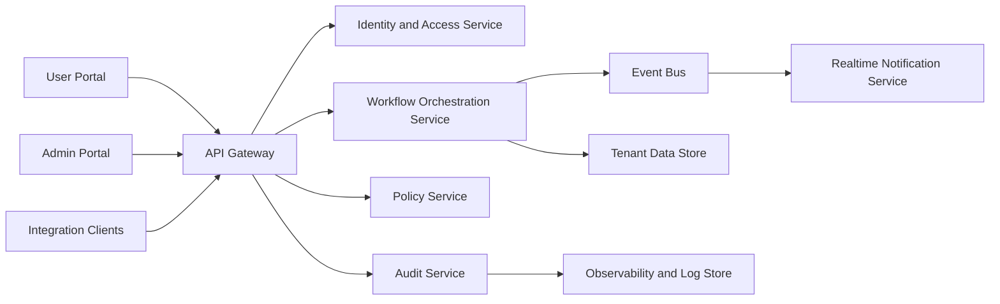
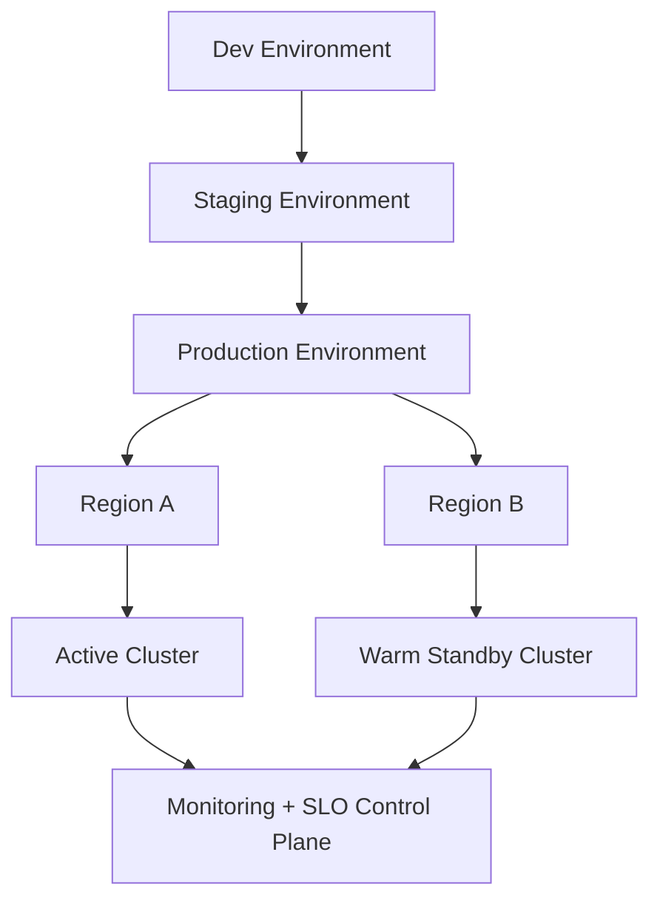

# Technology and Scalability Architecture Overview

## 1. Architecture Objectives

- Support multi-tenant enterprise workloads with strict data and access isolation.
- Maintain high availability under growth while preserving cost efficiency.
- Provide auditable and policy-governed execution pathways.
- Enable rapid feature shipping without compromising reliability.

## 2. Logical Architecture

## 3. Deployment Topology

## 4. Scalability Model

| Layer | Scaling Pattern | Target |
|---|---|---|
| API gateway | horizontal autoscaling | sustain p95 < 250ms at 10k concurrent users |
| Workflow services | queue-backed worker scaling | linear throughput growth by worker count |
| Data layer | partitioning + read replicas | maintain write consistency and read performance |
| Event bus | partitioned topics by tenant/workflow | no single-tenant noisy-neighbor degradation |
| Realtime layer | fan-out optimized channels | sub-2s event propagation for critical updates |

## 5. Reliability and Resilience

| Control | Design Standard |
|---|---|
| Availability target | 99.95% service uptime |
| Error budget policy | monthly error budget with automatic release gating |
| Backup/restore | daily full + intraday incremental |
| DR target | RPO <= 15 minutes, RTO <= 2 hours |
| Rollback | blue/green with one-click rollback |

## 6. Security and Compliance Controls

- OAuth2 + JWT with short-lived access tokens and rotating refresh policy.
- Encryption in transit (TLS 1.2+) and at rest (managed keys).
- Secret management isolated from application runtime.
- Immutable audit logs for all admin and policy-relevant events.
- Fine-grained RBAC/ABAC supporting tenant and org boundaries.

## 7. Performance and Cost Efficiency

| Lever | Impact |
|---|---|
| Query and cache optimization | lower compute costs and improved latency |
| Workload-aware autoscaling | cost elasticity during demand spikes |
| Event-driven processing | reduced synchronous bottlenecks |
| Multi-tenant resource guardrails | predictable unit cost per customer |

## 8. Architecture Governance

- ADR-required process for material architecture changes.
- Quarterly scalability review tied to growth plan.
- Capacity planning integrated into financial model and board updates.
